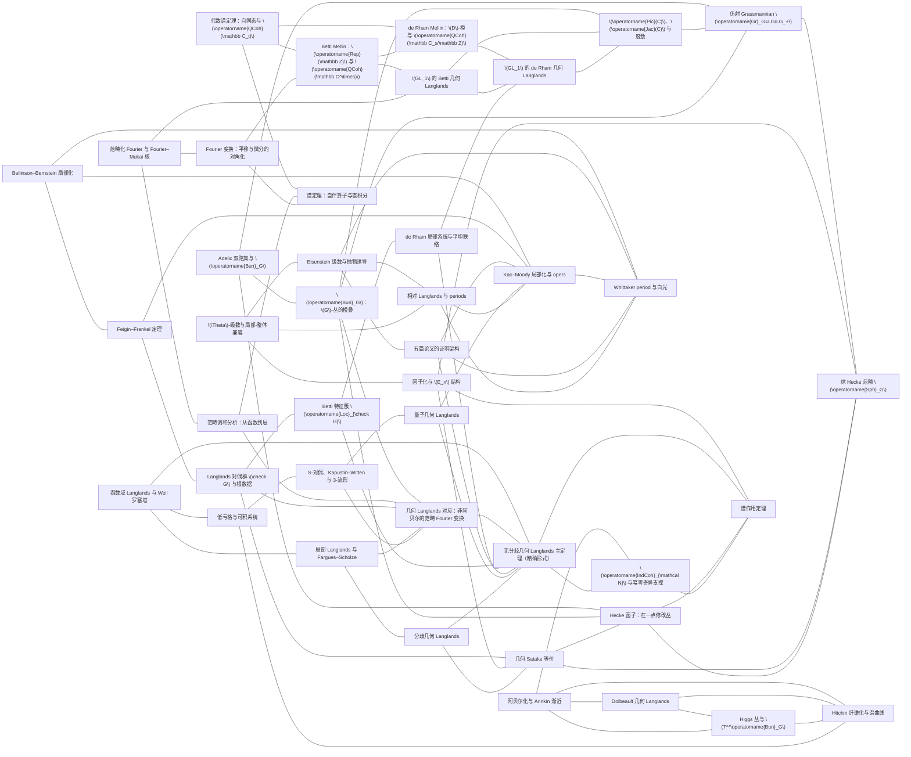

# benzvi_glc 卡片依赖图（MAP）

节点为卡 id 的 slug；边 `A --- B` 表示 A 的 `related` 指向 B。

```mermaid
flowchart LR
  abelianization["阿贝尔化与 Arinkin 渐近"]
  adelic_uniformization["Adelic 双陪集与 \(\operatorname{Bun}_G\)"]
  affine_grassmannian["仿射 Grassmannian \(\operatorname{Gr}_G=LG/LG_+\)"]
  algebraic_spectral_theorem["代数谱定理：自同态与 \(\operatorname{QCoh}(\mathbb C_t)\)"]
  beilinson_bernstein["Beilinson–Bernstein 局部化"]
  betti_mellin["Betti Mellin：\(\operatorname{Rep}(\mathbb Z)\) 与 \(\operatorname{QCoh}(\mathbb C^\times)\)"]
  bun_g["\(\operatorname{Bun}_G\)：\(G\)-丛的模叠"]
  categorical_fourier["范畴化 Fourier 与 Fourier–Mukai 核"]
  categorical_harmonic_analysis["范畴调和分析：从函数到层"]
  derham_mellin["de Rham Mellin：\(D\)-模与 \(\operatorname{QCoh}(\mathbb C_s/\mathbb Z)\)"]
  dolbeault_glc["Dolbeault 几何 Langlands"]
  dual_group["Langlands 对偶群 \(\check G\) 与根数据"]
  eisenstein_series["Eisenstein 级数与抛物诱导"]
  factorization["因子化与 \(E_n\) 结构"]
  feigin_frenkel["Feigin–Frenkel 定理"]
  fourier_transform["Fourier 变换：平移与微分的对角化"]
  function_field_langlands["函数域 Langlands 与 Weil 罗塞塔"]
  geometric_satake["几何 Satake 等价"]
  gl1_betti_glc["\(GL_1\) 的 Betti 几何 Langlands"]
  gl1_derham_glc["\(GL_1\) 的 de Rham 几何 Langlands"]
  glc_overview["几何 Langlands 对应：非阿贝尔的范畴 Fourier 变换"]
  glc_statement["无分歧几何 Langlands 主定理（精确形式）"]
  hecke_operators["Hecke 函子：在一点修改丛"]
  higgs_bundles["Higgs 丛与 \(T^*\operatorname{Bun}_G\)"]
  hitchin_fibration["Hitchin 纤维化与谱曲线"]
  indicoh_nilpotent_support["\(\operatorname{IndCoh}_{\mathcal N}\) 与幂零奇异支撑"]
  kac_moody_opers["Kac–Moody 局部化与 opers"]
  loc_g_betti["Betti 特征簇 \(\operatorname{Loc}_{\check G}\)"]
  loc_g_derham["de Rham 局部系统与平坦联络"]
  local_langlands["局部 Langlands 与 Fargues–Scholze"]
  low_genus["低亏格与可积系统"]
  physics_s_duality["S-对偶、Kapustin–Witten 与 3-流形"]
  picard_jacobian["\(\operatorname{Pic}(C)\)、\(\operatorname{Jac}(C)\) 与度数"]
  proof_map["五篇论文的证明架构"]
  quantum_glc["量子几何 Langlands"]
  ramified_glc["分歧几何 Langlands"]
  relative_langlands["相对 Langlands 与 periods"]
  spectral_action["谱作用定理"]
  spectral_theorem["谱定理：自伴算子与直积分"]
  spherical_hecke_category["球 Hecke 范畴 \(\operatorname{Sph}_G\)"]
  theta_series["\(\Theta\)-级数与局部-整体兼容"]
  whittaker_period["Whittaker period 与白光"]
  abelianization --- indicoh_nilpotent_support
  abelianization --- hitchin_fibration
  abelianization --- dolbeault_glc
  adelic_uniformization --- bun_g
  adelic_uniformization --- affine_grassmannian
  adelic_uniformization --- hecke_operators
  affine_grassmannian --- spherical_hecke_category
  affine_grassmannian --- bun_g
  algebraic_spectral_theorem --- spectral_theorem
  algebraic_spectral_theorem --- betti_mellin
  algebraic_spectral_theorem --- derham_mellin
  beilinson_bernstein --- kac_moody_opers
  beilinson_bernstein --- feigin_frenkel
  beilinson_bernstein --- whittaker_period
  betti_mellin --- derham_mellin
  betti_mellin --- gl1_betti_glc
  bun_g --- picard_jacobian
  bun_g --- hecke_operators
  bun_g --- glc_overview
  categorical_fourier --- categorical_harmonic_analysis
  categorical_fourier --- fourier_transform
  categorical_fourier --- gl1_betti_glc
  categorical_harmonic_analysis --- spectral_theorem
  categorical_harmonic_analysis --- glc_overview
  derham_mellin --- gl1_derham_glc
  dolbeault_glc --- higgs_bundles
  dolbeault_glc --- hitchin_fibration
  dual_group --- geometric_satake
  dual_group --- loc_g_betti
  dual_group --- glc_overview
  eisenstein_series --- relative_langlands
  eisenstein_series --- proof_map
  eisenstein_series --- whittaker_period
  factorization --- spectral_action
  factorization --- spherical_hecke_category
  factorization --- geometric_satake
  feigin_frenkel --- kac_moody_opers
  feigin_frenkel --- dual_group
  fourier_transform --- spectral_theorem
  fourier_transform --- betti_mellin
  function_field_langlands --- local_langlands
  function_field_langlands --- glc_statement
  function_field_langlands --- low_genus
  geometric_satake --- spherical_hecke_category
  geometric_satake --- hecke_operators
  gl1_betti_glc --- gl1_derham_glc
  gl1_betti_glc --- picard_jacobian
  gl1_derham_glc --- picard_jacobian
  glc_overview --- glc_statement
  glc_statement --- indicoh_nilpotent_support
  glc_statement --- spectral_action
  hecke_operators --- spherical_hecke_category
  hecke_operators --- spectral_action
  higgs_bundles --- hitchin_fibration
  higgs_bundles --- abelianization
  indicoh_nilpotent_support --- spectral_action
  kac_moody_opers --- whittaker_period
  loc_g_betti --- loc_g_derham
  loc_g_betti --- glc_statement
  loc_g_derham --- gl1_derham_glc
  loc_g_derham --- glc_statement
  local_langlands --- ramified_glc
  local_langlands --- glc_overview
  low_genus --- hitchin_fibration
  low_genus --- physics_s_duality
  physics_s_duality --- glc_overview
  physics_s_duality --- quantum_glc
  picard_jacobian --- affine_grassmannian
  proof_map --- glc_statement
  proof_map --- whittaker_period
  proof_map --- kac_moody_opers
  quantum_glc --- glc_statement
  quantum_glc --- kac_moody_opers
  ramified_glc --- geometric_satake
  ramified_glc --- glc_statement
  relative_langlands --- whittaker_period
  relative_langlands --- kac_moody_opers
  theta_series --- relative_langlands
  theta_series --- eisenstein_series
  theta_series --- factorization
```
